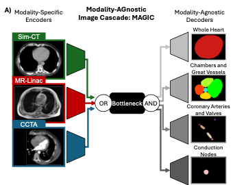
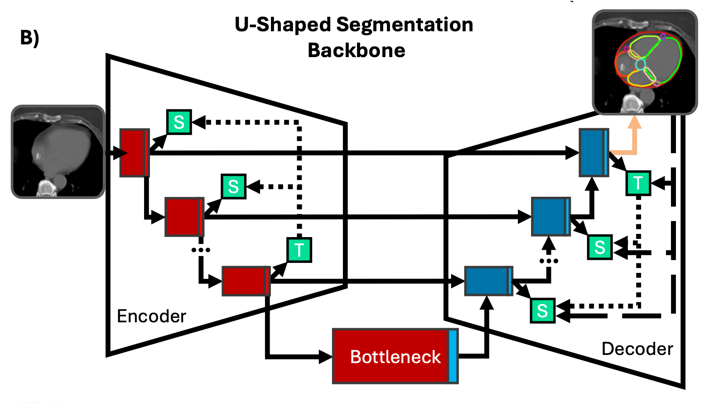

# Modality-AGnostic Image Cascade (MAGIC)

This work is available on [ArXiv](https://arxiv.org/abs/2506.10797) and has been submitted to the Green journal.

Repository for MAGIC, a segmentation framework for multi-modal and overlapping semantic segmentation.

Multi-modal segmentation enabled through parallel, modality-sepcific encoder branches following our previous work in kisonho's [MAGNET](https://github.com/kisonho/magnet/releases/tag/v1.1.3) [[Paper](https://ieeexplore.ieee.org/abstract/document/10230587)] and [MAG-MS](https://github.com/kisonho/magnet) [[Paper](https://ieeexplore.ieee.org/abstract/document/10635881)].

Overlapping segmentation enabled through multi-task learning with parallel multi-branch decoders targetting different non-overlapping groups of labels.

---
# U-Shaped Backbone

MAGIC's flexability to different inputs and outputs arises from duplicated encoding and decoding branches of a U-shaped backbone. By replicating the full branch and calling on components when they're needed, the function of a single model is preserved, remaining applicable to advnaced optimization frameworks or more complex model architectures.

In this repository, MAGIC has been implemneted on a patch-based [nnU-Net](https://github.com/MIC-DKFZ/nnUNet/tree/master) adpated with dual-self distillation as implemented and validated in [soumbane's DualSelfDistillation](https://github.com/soumbane/DualSelfDistillation) [[Paper](https://ieeexplore.ieee.org/abstract/document/10985772)] with clinical evaluation performed for [cardiac segmentation on MR-Linac volumes](https://github.com/NRSummerfield/nnU-Net.wSD/tree/main) [[Paper](https://www.sciencedirect.com/science/article/pii/S0360301624006710)].

---
## Contents:
This github repository consists of two main parts:
1) `MAGIC`: A cleaned, more user-friendly and direct version of MAGIC
2) `PaperImplementation`: The original code used to train MAGIC used in the associated publication. This version contains additional hard-coded and depreciated elements.
