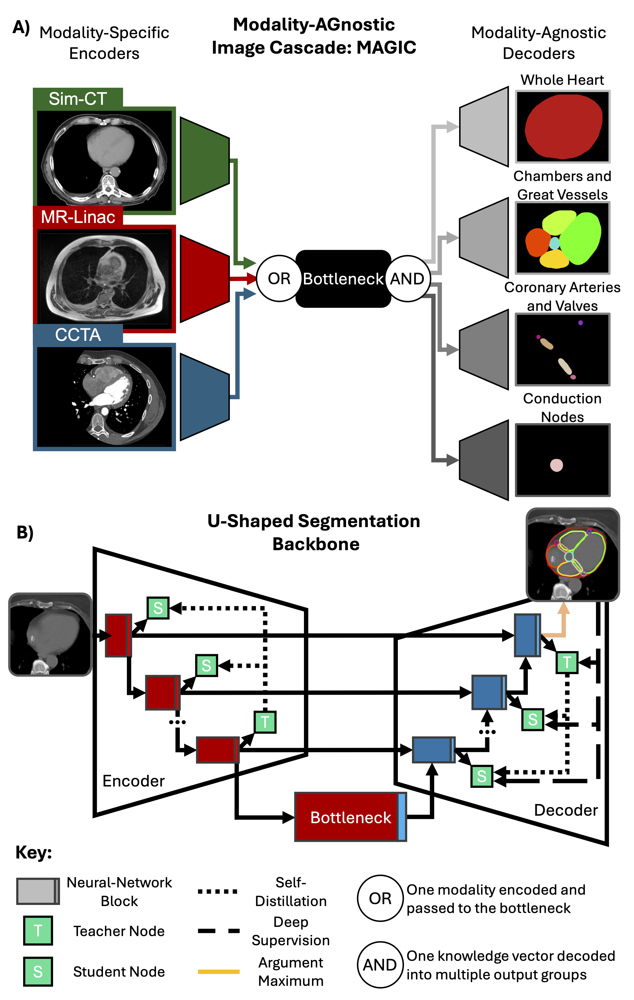

# Modality-AGnostic Image Cascade (MAGIC)

Repository for MAGIC, a segmentation framework for multi-modal and overlapping semantic segmentation.

Multi-modal segmentation enabled through parallel, modality-sepcific encoder branches following our previous work on [MAGNET](https://github.com/kisonho/magnet/releases/tag/v1.1.3) and [MAG-MS](https://github.com/kisonho/magnet).

Overlapping segmentation enabled through multi-task learning with parallel multi-branch decoders targetting different non-overlapping groups of labels.

---

MAGIC has been implemented here on an patch-based [nnU-Net](https://github.com/MIC-DKFZ/nnUNet/tree/master) with dual-self distillation as implemented in [soumbane's DualSelfDistillation](https://github.com/soumbane/DualSelfDistillation) with clinical validation for [cardiac segmentation on MR-Linac volumes](https://github.com/NRSummerfield/nnU-Net.wSD/tree/main).

This work is available on [ArXiv](https://arxiv.org/abs/2506.10797) and has been submitted to the Green journal.
