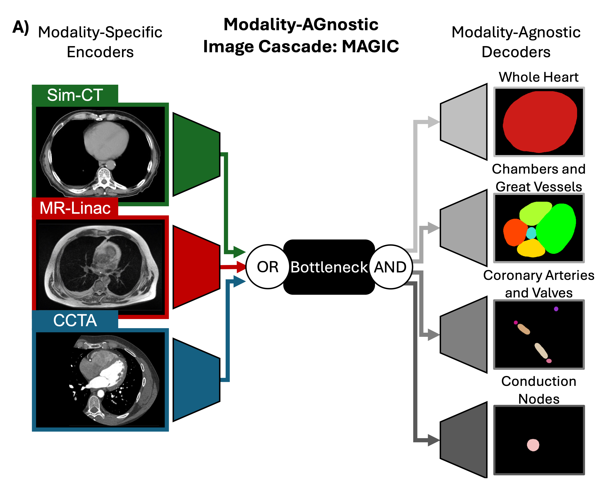

# Modality-AGnostic Image Cascade (MAGIC)

Repository for MAGIC, a segmentation framework for multi-modal and overlapping semantic segmentation.

This work is currently available on [ArXiv](https://arxiv.org/abs/2506.10797).

Multi-modal segmentation enabled through parallel, modality-sepcific encoder branches following our previous work in kisonho's [MAGNET](https://github.com/kisonho/magnet/releases/tag/v1.1.3) [[Paper](https://ieeexplore.ieee.org/abstract/document/10230587)] and [MAG-MS](https://github.com/kisonho/magnet) [[Paper](https://ieeexplore.ieee.org/abstract/document/10635881)].

Overlapping segmentation enabled through multi-task learning with parallel multi-branch decoders targetting different non-overlapping groups of labels.



---
# U-Shaped Backbone

MAGIC's flexability to different inputs and outputs arises from duplicated encoding and decoding branches of a U-shaped backbone. By replicating the full branch and calling on components when they're needed, the function of a single model is preserved, remaining applicable to advnaced optimization frameworks or more complex model architectures.

In this repository, MAGIC has been implemneted on a patch-based [nnU-Net](https://github.com/MIC-DKFZ/nnUNet/tree/master) adpated with dual-self distillation as implemented and validated in [soumbane's DualSelfDistillation](https://github.com/soumbane/DualSelfDistillation) [[Paper](https://ieeexplore.ieee.org/abstract/document/10985772)] with clinical evaluation performed for [cardiac segmentation on MR-Linac volumes](https://github.com/NRSummerfield/nnU-Net.wSD/tree/main) [[Paper](https://www.sciencedirect.com/science/article/pii/S0360301624006710)].


---
## Contents:
This github repository consists of two main parts:
1) `MAGIC`: A cleaned, more user-friendly and direct version of MAGIC
2) `PaperImplementation`: The original code used to train MAGIC used in the associated publication. This version contains additional hard-coded and depreciated elements.

---
## Overview of MAGIC

Modality-agnostic and multi-task segmentation in MAGIC arise from modality-specific, shared, and task-specific modules. For a given U-shaped backbone, the network architecture can be split into three components as shown in the above figure:
1) Bottleneck: The deepest connection between the encoding and decoding blocks. All input and output information is passed through the same, unified bottleneck.
2) Encoding Branch: All blocks that encode the input into the bottleneck. One encoder is initialized for each input modality
3) Decoding Branch: All blocks that decode the bottleneck into a prediction. One decoder is initialized for each segmentation task

### Example: Cardiac segmentation presented in associated paper.

In this example, there are three input modalities (1, 2, 3) and four segmentation tasks (A, B, C, D). There are therefore 3 encoders (Enc_1, Enc_2, Enc_3) that take in an input and produce a modality-specific input to the bottleneck. Then there are 4 decoders (Dec_A, Dec_B, Dec_C, Dec_D) that decode to an output. Finally there is a single bottleneck module.

For a "standard" segmentation task where you only have a single input modality and a single segmentation task, you get the original functionality of a U-shaped network as such:
  `Prediction = Dec_A(Bottleneck(Enc_1(Image)))`.

For this example, you ultimate encode the image and pass it through the bottleneck _once_ then pass it through each individual decoder. If you're interested in modality (1):
```
out_bottle_neck = Bottleneck(Enc_1(Image))
out = []
for dec in [Dec_A, Dec_B, Dec_C, Dec_D]:
  out.append(
    dec(out_bottle_neck)
  )
out = torch.concatinate(out, dim=1)
```

## Implementation description
This section contains details about how MAGIC is implemented. Please see `MAGIC/train_MAGIC.py` for a cleaned version replicating how it was implemented in the associated paper.

### Making a prediction

To achieve this type of multi-task output with a single encoding step, MAGIC predicts all four branches at once using split decoder modules as done in `MAGIC/Networks/nnUNet_wSD_decomposed_splitOutput.py`. This conserves applicability to other functions like MONAI's `sliding_window_inference` function. However, this does mean the final output is pre-concatinated and the user must keep track of what output channels correspond to what segmentation group and perform an `argmax` on each group accordingly.

Once initialized, MAGIC contains a dictionary of callable functions that act as complete models to return the stacked output as above
```
MAGIC = MAGIC_framework( ... ) # Initialize MAGIC
predictor_model_modality_1: Callabel[[torch.Tensor], torch.Tensor] = MAGIC.tricks[modality_1] # Get the modality-specific, callable function that makes the prediction
```
